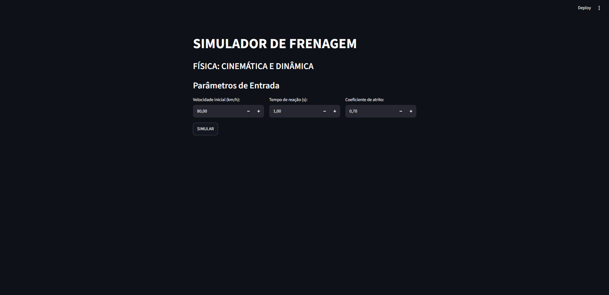
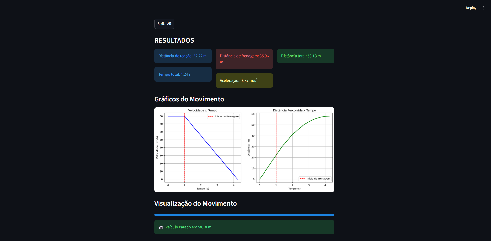
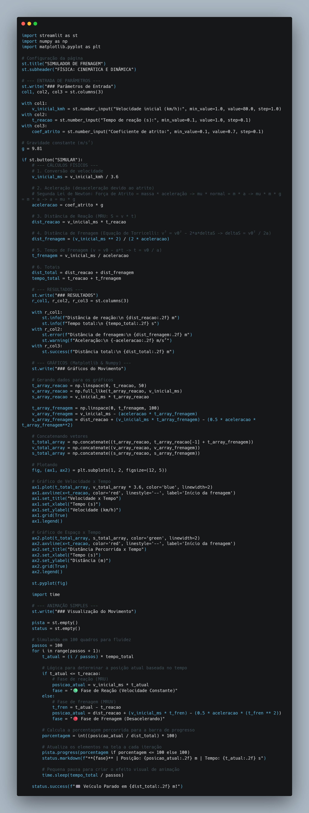

# Simulador de Frenagem - Física: Cinemática e Dinâmica 🚗🛑

Projeto Integrador Científico Aplicado desenvolvido para o curso de Engenharia de Computação do Centro Universitário ENIAC.

## 👥 Desenvolvedores
- **Kauã Almeida Lima** 
- **Nicolle Caroline Mota** 

## 🎯 Objetivo do Projeto
Transformar um fenômeno físico em um modelo matemático e, posteriormente, em um sistema computacional interativo. O sistema permite analisar como fatores como velocidade inicial, tempo de reação e coeficiente de atrito influenciam a distância total até a parada de um veículo.

## 💻 Tecnologias Utilizadas
- **Python** (Linguagem principal, cálculos e lógica)
- **Streamlit** (Criação da interface interativa e visualização do movimento)
- **NumPy** (Operações matemáticas e geração de dados da simulação)
- **Matplotlib** (Criação de gráficos de Velocidade x Tempo e Distância x Tempo)

## ⚙️ Como Executar o Simulador

1. Certifique-se de ter o Python instalado em sua máquina.
2. Clone este repositório e acesse a pasta do projeto.
3. Instale as dependências necessárias utilizando o terminal:
   ```bash
   pip install streamlit numpy matplotlib
   ```
4. Execute o aplicativo:
   ```bash
   streamlit run simulador.py
   ```
5. O simulador abrirá automaticamente no seu navegador padrão.

## 📸 Evidências e Protótipos

<p align="center">
  
  
</p>

## 🧑‍💻 Código-fonte do Simulador

O [código-fonte completo](simulador.py) implementa o cálculo da distância de reação e de frenagem, gera os gráficos do movimento e apresenta uma animação interativa no navegador.

<p align="center">
  
</p>

<p align="center"><em>Implementação do simulador em Python com Streamlit, NumPy e Matplotlib.</em></p>

## 🔬 Metodologia e Experimento Físico
O simulador computacional divide o fenômeno físico em duas fases principais:
1. **Fase de Reação (MRU):** O veículo mantém a velocidade inicial durante o tempo de reação do motorista.
2. **Fase de Frenagem (MRUV):** Os freios são acionados, e a força de atrito atua para desacelerar o carro até a parada total.

Como complemento prático, realizamos testes físicos utilizando um carrinho em diferentes superfícies. Os resultados experimentais (tempo e distância) foram coletados para serem comparados com os dados teóricos gerados pelo nosso modelo matemático.
